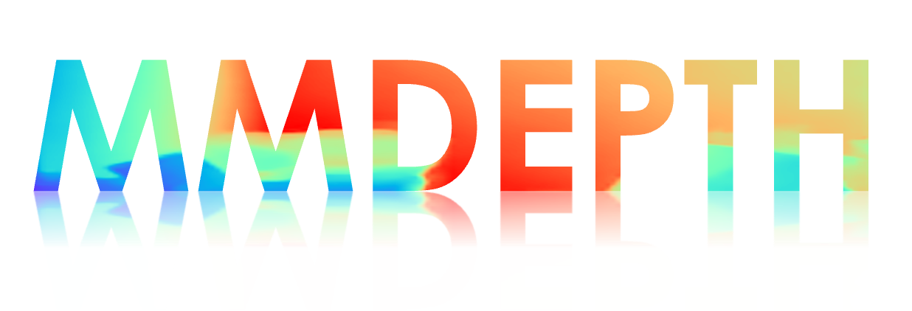

<div align="center">
  
  <div align="center">
    <b><font size="5">Monocular Depth Estimation Toolbox and Benchmark</font></b>
  </div>
  <div>&nbsp;</div>


[](https://github.com/RuijieZhu94/mmdepth/docs)
[](https://github.com/RuijieZhu94/mmdepth/blob/main/LICENSE)
[](https://github.com/RuijieZhu94/mmdepth/issues)
[](https://github.com/RuijieZhu94/mmdepth/issues)
 
</div>


## Introduction

MMDepth is an open source monocular depth estimation toolbox based on PyTorch.
The [main](https://github.com/RuijieZhu94/mmdepth/tree/main) branch works with PyTorch 1.6+.

Note that this repo is ***not*** a part of the OpenMMLab project. It is built on top of [MMSegmentation](https://github.com/open-mmlab/mmsegmentation).
If there is any infringement please contact ruijiezhu@mail.ustc.edu.cn.


### 🎉 Introducing mmdepth v1.0.0 🎉

Since this is the first version of this repo, there are inevitably many imperfections. The code library inherits most of the functions and advantages of MMSegmentation, and adds or expands some components. We welcome you to develop and maintain this repo together!


### Major features

- **Unified Benchmark**

  We provide a unified toolbox and benchmark for training or testing models on multiple depth datasets.


- **Modular Design**

  Following OpenMMLab series, we decompose the monocular depth estimation models into different components. As a result, it is easy to construct a customized monocular depth estimation model by combining different modules.


## User guides

Please refer to [get_started.md](docs/get_started.md) for installation and [dataset_prepare.md](docs/dataset_prepare.md) for dataset preparation.

Please refer to [train.md](docs/train.md) for model training and [inference.md](docs/inference.md) for model inference.

For detailed guides for development, please see [tutorials](https://github.com/open-mmlab/mmsegmentation?tab=readme-ov-file#tutorial) from MMSegmentation.

```
mmdepth
├── assets
├── configs
│   └── _base_
├── data
│   ├── ddad
│   ├── diml
│   ├── ...
├── docs
├── LICENSE
├── mmdepth
│   ├── apis
│   ├── datasets
│   ├── engine
│   ├── ...
├── mmdepth.egg-info
├── model-index.yml
├── projects
│   ├── Binsformer
│   ├── Plane2Depth
│   └── ScaleDepth
├── README.md
├── ...
├── tests
├── tools
└── work_dirs
```

## Projects

Here are some implementations of SOTA models and solutions built on MMDepth, which are supported and maintained by community users. These projects demonstrate the best practices based on MMDepth for research and product development. We welcome and appreciate all the contributions to these projects.
Also, we appreciate all contributions to improve MMDepth framework.


<table style="border-collapse: collapse; border: none;">

  <tr style="border: none;">
    <td style="align-items:center; width: 25%; border: none;">
      
    </td>
    <td style="align-items:center; border: none;">
      <a href="https://github.com/RuijieZhu94/mmdepth/tree/main/projects/ScaleDepth">ScaleDepth: Decomposing Metric Depth Estimation into Scale Prediction and Relative Depth Estimation</a>
      <br>Ruijie Zhu, Chuxin Wang, Ziyang Song, Li Liu, Tianzhu Zhang, Yongdong Zhang
      <br> Arxiv, 2024
      <br> 
      <a href="https://arxiv.org/abs/2407.08187">[Paper]</a>
      <a href="https://ruijiezhu94.github.io/ScaleDepth">[Webpage]</a>
      <a href="https://github.com/RuijieZhu94/mmdepth/tree/main/projects/ScaleDepth">[Code]</a>
    </td>
  </tr>

  <tr style="border: none;">
    <td style="align-items:center; width: 25%; border: none;">
      
    </td>
    <td style="align-items:center; border: none;">
      <a href="https://github.com/RuijieZhu94/mmdepth/tree/main/projects/Plane2Depth">Plane2Depth: Hierarchical Adaptive Plane Guidance for Monocular Depth Estimation</a>
      <br>Li Liu*, Ruijie Zhu*, Jiacheng Deng, Ziyang Song, Wenfei Yang, Tianzhu Zhang
      <br> TCSVT, 2024
      <br> 
      <a href="https://arxiv.org/abs/2409.02494">[Paper]</a>
      <a href="https://ruijiezhu94.github.io/plane2depth_page/">[Webpage]</a>
      <a href="https://github.com/RuijieZhu94/mmdepth/tree/main/projects/Plane2Depth">[Code]</a>
    </td>
  </tr>

  <tr style="border: none;">
    <td style="align-items:center; width: 25%; border: none;">
      
    </td>
    <td style="align-items:center; border: none;">
      <a href="https://github.com/RuijieZhu94/mmdepth/tree/main/projects/Binsformer">BinsFormer: Revisiting Adaptive Bins for Monocular Depth Estimation</a>
      <br>Zhenyu Li, Xuyang Wang, Xianming Liu, and Junjun Jiang
      <br> IEEE Transactions on Image Processing, 2024
      <br> 
      <a href="https://arxiv.org/abs/2204.00987">[Paper]</a>
      <a href="https://github.com/zhyever/Monocular-Depth-Estimation-Toolbox">[Code]</a>
    </td>
  </tr>
</table>

## Benchmark and model zoo

Results and models are available in the [model zoo](docs/model_zoo.md).

<div align="center">
  <b>Overview</b>
</div>
<table align="center">
  <tbody>
    <tr align="center" valign="center">
      <td>
        <b>Supported datasets</b>
      </td>    
      <td>
        <b>Supported backbones</b>
      </td>
      <td>
        <b>Supported head</b>
      </td>
      <td>
        <b>Supported loss</b>
      </td>
    </tr>
    <tr valign="top">
      <td>
        <ul>
          <li><a href="https://cs.nyu.edu/~fergus/datasets/nyu_depth_v2.html">NYU-Depth V2</a></li>
          <li><a href="https://www.cvlibs.net/datasets/kitti/eval_depth.php?benchmark=depth_prediction">KITTI</a></li>
          <li><a href="https://rgbd.cs.princeton.edu/">SUN RGB-D</a></li>
          <li><a href="https://www.asg.ed.tum.de/lmf/ibims1/">iBims-1 Benchmark</a></li>
          <li><a href="https://diode-dataset.org/">DIODE</a></li>
          <li><a href="https://github.com/apple/ml-hypersim">HyperSim</a></li>
          <li><a href="https://europe.naverlabs.com/research-old2/computer-vision/proxy-virtual-worlds-vkitti-2/">Virtual KITTI 2</a></li>
          <li><a href="https://github.com/TRI-ML/DDAD">DDAD</a></li>
          <li><a href="https://dimlrgbd.github.io/">DIML</a></li>
        </ul>
      </td>
      <td>
        <ul>
        <li><a href="mmdepth/models/backbones/resnet.py">ResNet(CVPR'2016)</a></li>
        <li><a href="mmdepth/models/backbones/resnext.py">ResNeXt (CVPR'2017)</a></li>
        <li><a href="mmdepth/models/backbones/hrnet.py">HRNet (CVPR'2019)</a></li>
        <li><a href="mmdepth/models/backbones/resnest.py">ResNeSt (ArXiv'2020)</a></li>
        <li><a href="mmdepth/models/backbones/mobilenet_v2.py">MobileNetV2 (CVPR'2018)</a></li>
        <li><a href="mmdepth/models/backbones/mobilenet_v3.py">MobileNetV3 (ICCV'2019)</a></li>
        <li><a href="mmdepth/models/backbones/vit.py">Vision Transformer (ICLR'2021)</a></li>
        <li><a href="mmdepth/models/backbones/swin.py">Swin Transformer (ICCV'2021)</a></li>
        <li><a href="mmdepth/models/backbones/twins.py">Twins (NeurIPS'2021)</a></li>
        <li><a href="mmdepth/models/backbones/beit.py">BEiT (ICLR'2022)</a></li>
        <li><a href="mmdepth/models/backbones/convnext.py">ConvNeXt (CVPR'2022)</a></li>
        <li><a href="mmdepth/models/backbones/mae.py">MAE (CVPR'2022)</a></li>
        <li><a href="mmdepth/models/backbones/poolformer.py">PoolFormer (CVPR'2022)</a></li>
        <li><a href="mmdepth/models/backbones/segnext.py">SegNeXt (NeurIPS'2022)</a></li>
        <li><a href="projects/ScaleDepth/backbone/clip.py">CLIP (ICML'2021)</a></li>
        </ul>
      </td>      
      <td>
        <ul>
          <li><a href="mmdepth/models/decode_heads/ann_head.py">ANN_Head</li>
          <li><a href="mmdepth/models/decode_heads/apc_head.py">APC_Head</li>
          <li><a href="mmdepth/models/decode_heads/aspp_head.py">ASPP_Head</li>
          <li><a href="mmdepth/models/decode_heads/cc_head.py">CC_Head</li>
          <li><a href="mmdepth/models/decode_heads/da_head.py">DA_Head</li>
          <li><a href="mmdepth/models/decode_heads/ddr_head.py">DDR_Head</li>
          <li><a href="mmdepth/models/decode_heads/dm_head.py">DM_Head</li>
          <li><a href="mmdepth/models/decode_heads/dnl_head.py">DNL_Head</li>
          <li><a href="mmdepth/models/decode_heads/dpt_head.py">DPT_HEAD</li>
          <li><a href="mmdepth/models/decode_heads/ema_head.py">EMA_Head</li>
          <li><a href="mmdepth/models/decode_heads/enc_head.py">ENC_Head</li>
          <li><a href="mmdepth/models/decode_heads/fcn_head.py">FCN_Head</li>
          <li><a href="mmdepth/models/decode_heads/fpn_head.py">FPN_Head</li>
          <li><a href="mmdepth/models/decode_heads/gc_head.py">GC_Head</li>
          <li><a href="mmdepth/models/decode_heads/ham_head.py">LightHam_Head</li>
          <li><a href="mmdepth/models/decode_heads/isa_head.py">ISA_Head</li>
          <li><a href="mmdepth/models/decode_heads/knet_head.py">Knet_Head</li>
          <li><a href="mmdepth/models/decode_heads/lraspp_head.py">LRASPP_Head</li>
          <li><a href="mmdepth/models/decode_heads/mask2former_head.py">mask2former_Head</li>
          <li><a href="mmdepth/models/decode_heads/maskformer_head.py">maskformer_Head</li>
          <li><a href="mmdepth/models/decode_heads/nl_head.py">NL_Head</li>
          <li><a href="mmdepth/models/decode_heads/ocr_head.py">OCR_Head</li>
          <li><a href="mmdepth/models/decode_heads/pid_head.py">PID_Head</li>
          <li><a href="mmdepth/models/decode_heads/point_head.py">point_Head</li>
          <li><a href="mmdepth/models/decode_heads/psa_head.py">PSA_Head</li>
          <li><a href="mmdepth/models/decode_heads/psp_head.py">PSP_Head</li>
          <li><a href="mmdepth/models/decode_heads/san_head.py">SAN_Head</li>
          <li><a href="mmdepth/models/decode_heads/segformer_head.py">segformer_Head</li>
          <li><a href="mmdepth/models/decode_heads/segmenter_mask_head.py">segmenter_mask_Head</li>
          <li><a href="mmdepth/models/decode_heads/sep_aspp_head.py">SepASPP_Head</li>
          <li><a href="mmdepth/models/decode_heads/sep_fcn_head.py">SepFCN_Head</li>
          <li><a href="mmdepth/models/decode_heads/setr_mla_head.py">SETRMLAHead_Head</li>
          <li><a href="mmdepth/models/decode_heads/setr_up_head.py">SETRUP_Head</li>
          <li><a href="mmdepth/models/decode_heads/stdc_head.py">STDC_Head</li>
          <li><a href="mmdepth/models/decode_heads/uper_head.py">Uper_Head</li>
          <li><a href="mmdepth/models/decode_heads/vpd_depth_head.py">VPDDepth_Head</li>
          <li><a href="projects/ScaleDepth/decode_head/scaledepth_head.py">ScaleDepth_Head</li>
          <li><a href="projects/Plane2Depth/decode_head/plane2depth_head.py">Plane2Depth_Head</li>
          <li><a href="projects/Binsformer/decode_head/binsformer_head.py">BinsFormer_Head</li>
        </ul>
      </td>
      <td>
          <li><a href="mmdepth/models/losses/boundary_loss.py">boundary_loss</a></li>
          <li><a href="mmdepth/models/losses/cross_entropy_loss.py">cross_entropy_loss</a></li>
          <li><a href="mmdepth/models/losses/dice_loss.py">dice_loss</a></li>
          <li><a href="mmdepth/models/losses/focal_loss.py">focal_loss</a></li>
          <li><a href="mmdepth/models/losses/huasdorff_distance_loss.py">huasdorff_distance_loss</a></li>
          <li><a href="mmdepth/models/losses/kldiv_loss.py">kldiv_loss</a></li>
          <li><a href="mmdepth/models/losses/lovasz_loss.py">lovasz_loss</a></li>
          <li><a href="mmdepth/models/losses/ohem_cross_entropy_loss.py">ohem_cross_entropy_loss</a></li>
          <li><a href="mmdepth/models/losses/silog_loss.py">silog_loss</a></li>
          <li><a href="mmdepth/models/losses/tversky_loss.py">tversky_loss</a></li>
        </ul>
        </ul>
      </td>
  </tbody>
</table>


## Acknowledgement

MMDepth is an open source project maintained by the author alone (at least for now). The original intention of building this project is to provide a standardized toolbox and benchmark for monocular depth estimation. We thank the contributers of [MMSegmentation](https://github.com/open-mmlab/mmsegmentation) for providing a great template for this project. We also thank the authors of [Monocular-Depth-Estimation-Toolbox](https://github.com/zhyever/Monocular-Depth-Estimation-Toolbox) and [ZoeDepth](https://github.com/isl-org/ZoeDepth), whose code this project borrowed.

## Citation

If you find this project useful in your research, please consider cite:

```bibtex
@misc{mmdepth2024,
    title={{mmdepth}: Monocular Depth Estimation Toolbox and Benchmark},
    author={mmdepth contributors},
    howpublished = {\url{https://github.com/RuijieZhu94/mmdepth}},
    year={2024}
}
```

And if you find those SOTA models and solutions built on MMDepth useful, please also consider cite:
```bibtex
@article{zhu2024scaledepth,
  title={ScaleDepth: Decomposing Metric Depth Estimation into Scale Prediction and Relative Depth Estimation}, 
  author={Zhu, Ruijie and Wang, Chuxin and Song, Ziyang and Liu, Li and Zhang, Tianzhu and Zhang, Yongdong},
  journal={arXiv preprint arXiv:2407.08187},
  year={2024}
}
```
```bibtex
@article{liu2024plane2depth,
  title={Plane2Depth: Hierarchical Adaptive Plane Guidance for Monocular Depth Estimation},
  author={Liu, Li and Zhu, Ruijie and Deng, Jiacheng and Song, Ziyang and Yang, Wenfei and Zhang, Tianzhu},
  journal={IEEE Transactions on Circuits and Systems for Video Technology},
  year={2024},
  publisher={IEEE}
}
```
```bibtex
@article{li2022binsformer,
  title={BinsFormer: Revisiting Adaptive Bins for Monocular Depth Estimation},
  author={Li, Zhenyu and Wang, Xuyang and Liu, Xianming and Jiang, Junjun},
  journal={arXiv preprint arXiv:2204.00987},
  year={2022}
}
```
## License

This project is released under the [Apache 2.0 license](LICENSE).

