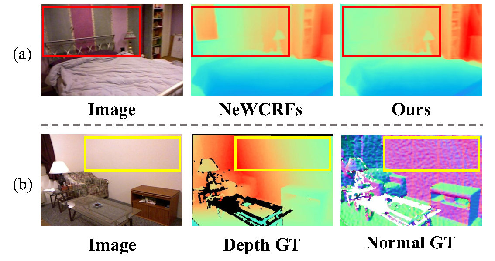
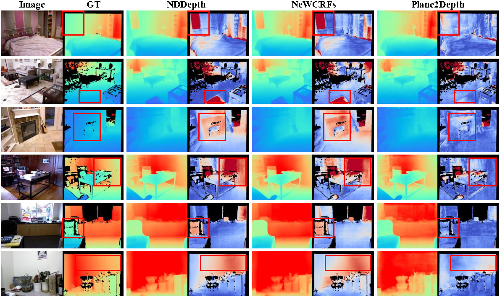
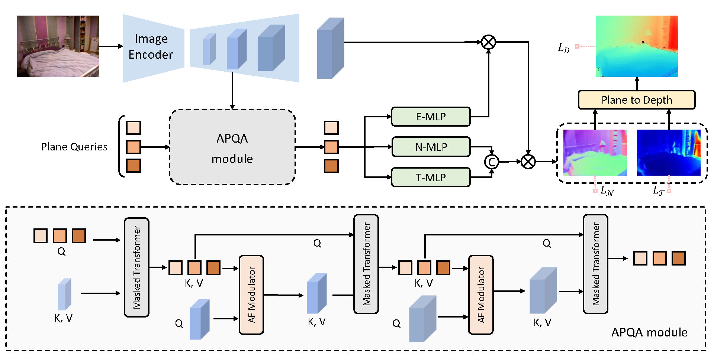

<h3 align="center"><strong>Plane2Depth: Hierarchical Adaptive Plane Guidance for Monocular Depth Estimation</strong></h3>

<p align="center">
  <a href="https://github.com/lliu00">Li Liu*</a>,
  <a href="https://ruijiezhu94.github.io/ruijiezhu/">Ruijie Zhu*</a>,
  <a href="https://github.com/JiachengDeng">Jiacheng Deng</a>,
  <a href="https://indu1ge.github.io/ziyangsong">Ziyang Song</a>,
  <a href="https://auto.ustc.edu.cn/2022/0711/c25977a562259/page.htm">Wenfei Yang</a>,
  <a href="http://staff.ustc.edu.cn/~tzzhang/">Tianzhu Zhang</a>,
  <br>
  University of Science and Technology of China
  <br>
  TCSVT 2024
</p>

<div align="center">
  <!-- <b>TL;DR: Finetuning CLIP with 4 RTX 3090 in 8 hours to obtain a robust metric depth estimation model!</b> -->
  <br>
  <a href='https://arxiv.org/abs/2409.02494'></a> &nbsp;&nbsp;&nbsp;&nbsp;&nbsp;
<!-- <a href='https://arxiv.org/abs/[]'></a> &nbsp;&nbsp;&nbsp;&nbsp;&nbsp; -->
  <a href='https://ruijiezhu94.github.io/plane2depth_page'></a> &nbsp;&nbsp;&nbsp;&nbsp;&nbsp;
  <!-- <a href='https://github.com/RuijieZhu94/ScaleDepth/tree/main?tab=Apache-2.0-1-ov-file'></a> &nbsp;&nbsp;&nbsp;&nbsp;&nbsp; -->
  <a href='https://ruijiezhu94.github.io/plane2depth_page'></a>
  <br>
  <br>

<!-- [](https://paperswithcode.com/sota/monocular-depth-estimation-on-diml-outdoor?p=scaledepth-decomposing-metric-depth)
	
[](https://paperswithcode.com/sota/monocular-depth-estimation-on-diode-indoor?p=scaledepth-decomposing-metric-depth)
	
[](https://paperswithcode.com/sota/monocular-depth-estimation-on-diode-outdoor?p=scaledepth-decomposing-metric-depth)
	
[](https://paperswithcode.com/sota/monocular-depth-estimation-on-hypersim?p=scaledepth-decomposing-metric-depth)
	
[](https://paperswithcode.com/sota/monocular-depth-estimation-on-ibims-1?p=scaledepth-decomposing-metric-depth)
	
[](https://paperswithcode.com/sota/monocular-depth-estimation-on-virtual-kitti-2?p=scaledepth-decomposing-metric-depth)
	
[](https://paperswithcode.com/sota/monocular-depth-estimation-on-ddad?p=scaledepth-decomposing-metric-depth)
	
[](https://paperswithcode.com/sota/monocular-depth-estimation-on-sun-rgbd?p=scaledepth-decomposing-metric-depth)
	
[](https://paperswithcode.com/sota/monocular-depth-estimation-on-kitti-eigen?p=scaledepth-decomposing-metric-depth)
	
[](https://paperswithcode.com/sota/monocular-depth-estimation-on-nyu-depth-v2?p=scaledepth-decomposing-metric-depth) -->
</div>

<p align="center">

</p>

> We present an example of “visual deception” in (a). 
  The significant color discrepancies mislead the network into predicting an incorrect depth map. 
  Our method successfully mitigates this issue by using plane information. 
  In (b), pixels within the yellow bounding box correspond to different depths but share the same surface normal (indicated by
  identical colors representing the corresponding values). 
  Since the generation of ground truth for surface normal depends on conventional algorithms, there exists a slight offset.

<p align="center">

</p>

> Our approach improves the depth prediction in areas with repetitive patterns (rows 1-3) and weak textures (rows 4-6). The network
is able to distinguish the pixels belonging to the same plane even with different colors, resulting in more accurate and consistent depth predictions.

<p align="center">

</p>

> The overall architecture of Plane2Depth. 
We use a set of plane queries to predict plane coefficients through E-MLP, N-MLP, and T-MLP, respectively. 
Then the predicted plane coefficients are converted to metric depth maps through the pinhole camera model.
For consistent query prediction, we adopt the APQA module to aggregate multi-scale image features and adaptively modulate them via AF modulators.


## Installation

Please refer to [get_started.md](../../docs/get_started.md#installation) for installation and [dataset_prepare.md](docs/dataset_prepare.md#prepare-datasets) for dataset preparation.


You may also need to install these packages:
```shell
pip install "mmdet>=3.0.0rc4"
pip install open_clip_torch
pip install future tensorboard
pip install -r requirements/albu.txt
```

<!-- And download the checkpoint of text embeddings from [Google Drive](https://drive.google.com/file/d/1Am2YWjtbWgMP4mwLjS5gmjKmawhrPyBe/view?usp=sharing) and place it to `projects/ScaleDepth/pretrained_weights` folder. -->

## Training and Inference

We provide [train.md](docs/train.md) and [inference.md](docs/inference.md) for the instruction of training and inference. 

### Train
```shell
# NYU
bash tools/dist_train.sh projects/Plane2Depth/configs/Plane2Depth/plane2depth_swin_large_NYU_480x640.py 4
```

### Test
```shell
# NYU
python tools/test.py projects/ScaleDepth/configs/Plane2Depth/plane2depth_swin_large_NYU_480x640.py <the path of your checkpoint>

```

<!-- ## Offical weights

| Method | Backbone | Train Iters | Results  | Config | Checkpoint | GPUs |
| ------ | :------: | :---------: | :----------: | :----: | :--------: | :---:|
| ScaleDepth-NK | CLIP(ConvNext-Large)   |  40000   |  [log](log/ScaleDepth-NK.md) |  [config](configs/ScaleDepth/scaledepth_clip_NYU_KITTI_352x512.py) | [iter_40000.pth](https://drive.google.com/file/d/1QYS6A5--swzxfwMqjvk9ekF0Ds0GefM1/view?usp=drive_link) | 4 RTX 3090 | -->

## Bibtex

If you like our work and use the codebase or models for your research, please cite our work as follows.

```
@article{liu2024plane2depth,
  title={Plane2Depth: Hierarchical Adaptive Plane Guidance for Monocular Depth Estimation},
  author={Liu, Li and Zhu, Ruijie and Deng, Jiacheng and Song, Ziyang and Yang, Wenfei and Zhang, Tianzhu},
  journal={IEEE Transactions on Circuits and Systems for Video Technology},
  year={2024},
  publisher={IEEE}
}
```
## Acknowledgement
We thank Jiacheng Deng and Wenfei Yang for their thoughtful and valuable suggestions.
We thank the authors of [Binsformer](https://github.com/zhyever/Monocular-Depth-Estimation-Toolbox) for their code.

